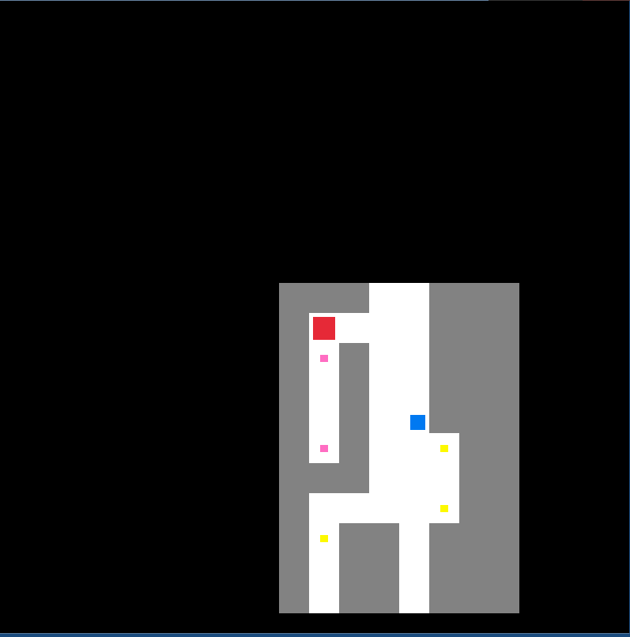

# DungeonShadows
A 2d rogue-like dungeon crawler in development using raylib.
## In development

# Implemented features
- An item system, where the player picks up the loot that enemies drop
- A system for reloading the map so that changes can be made and viewed while the game is running

# Features to add
- UI
- Randomly generated maps using
- Animations
- Textures

# How to build
- Clone the repo, raylib is already in the project in the extern folder, and the headers for it in the include folder
- Open the root folder of the cloned repo with Visual Studio, make sure that your Visual Studio has the CMake package installed, if not install that first
- Click build

# Screenshot

